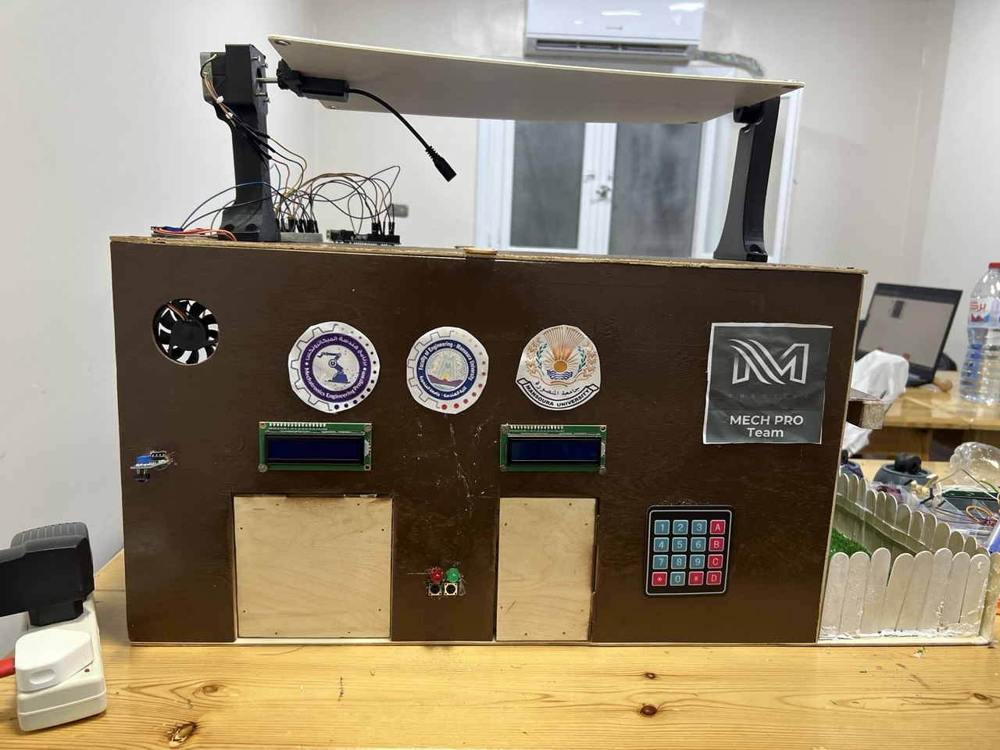
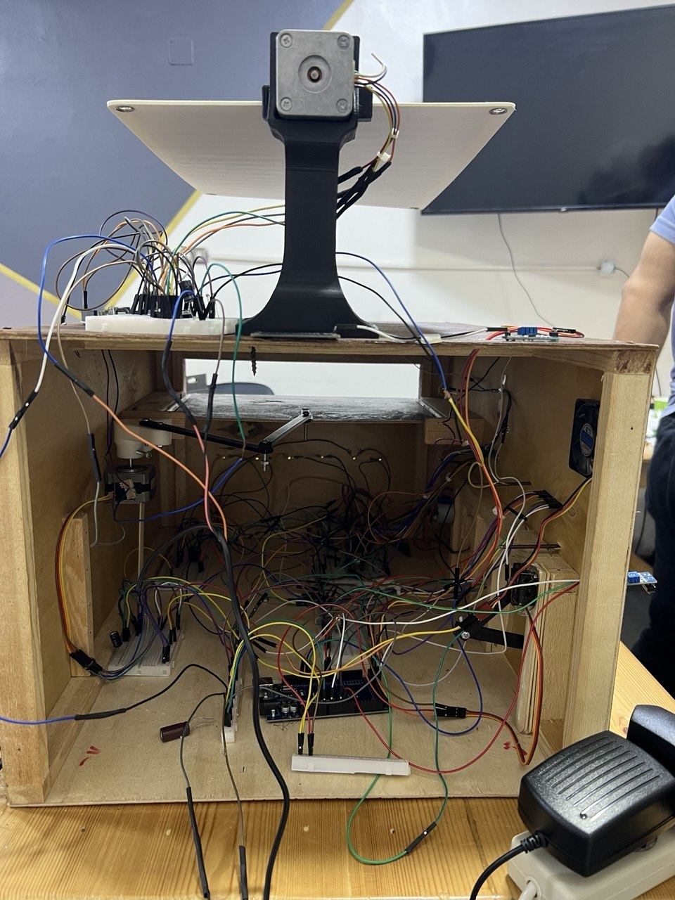
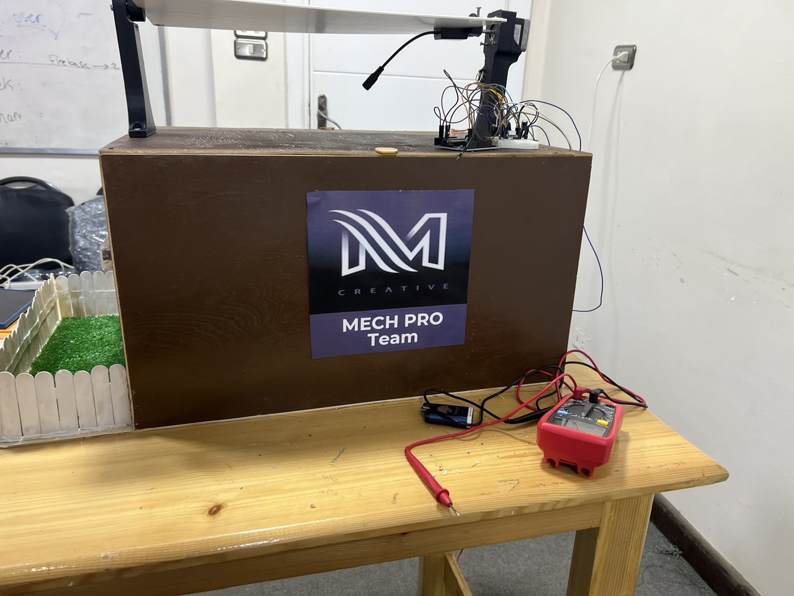

# Arduino Smart Home System

## Overview

This project is a physical Arduino-based smart home automation prototype developed as an academic mechatronics project.

It combines sensors, LCD display output, servo motors, LEDs, a fan, a keypad, and embedded control logic inside a small smart-home model. The system demonstrates basic embedded systems and mechatronics concepts by connecting hardware and software components in one complete automation project.

## Academic Context

This project was developed as Project 1 during my Mechatronics Engineering studies at Mansoura University.

The goal was to build a physical smart-home prototype and apply embedded systems, sensors, actuators, and automation logic in a practical mechatronic system.

## Main Features

### Password-Protected Door System

- A keypad is used to enter a password
- If the correct password is entered, the door opens using a servo motor
- The LCD display shows password and access-status messages
- LEDs indicate correct or wrong access status
- This simulates a basic smart access-control system

### Automatic Garage Door

- A motion sensor detects movement near the garage
- When movement is detected, the garage door opens automatically using a servo motor
- The garage closes again automatically after a defined time
- This simulates a simple automatic garage system

### Temperature-Based Fan Control

- An LM35 temperature sensor measures the surrounding temperature
- If the temperature is higher than the defined limit, the fan turns on automatically
- When the temperature returns to a normal range, the fan turns off
- This simulates basic automatic climate control

### Automatic Light Control

- An LDR light sensor measures the surrounding light level
- If the environment becomes dark, the LEDs turn on automatically
- If there is enough light, the LEDs turn off
- This simulates automatic day/night lighting control

### Light-Dependent Solar Tracking Concept

- Two LDR sensors are used to compare light intensity from two directions
- A servo-controlled mechanism changes the panel direction based on the stronger light source
- This simulates a simple solar-tracking concept for improving light exposure

## Project Demonstration

This project was implemented as a real physical prototype. The model includes a keypad access system, LCD status display, automatic lighting, temperature-based fan control, servo-controlled doors, internal wiring, and a light-dependent solar-tracking mechanism.

### Final Smart Home Model



### Internal Wiring and Components



### Solar Tracking Mechanism



## Technologies Used

- Arduino Mega 2560
- Arduino IDE
- Embedded C/C++
- Sensor integration
- Servo motor control
- LCD display control
- Basic electronics
- Embedded systems concepts

> Note: The full-featured version is written for Arduino Mega 2560 because the project uses several sensors, a keypad, an LCD display, multiple servo motors, LEDs, and a fan. An Arduino Uno version is possible only with reduced features or additional modules such as an I/O expander.

## Required Arduino Libraries

- Keypad
- Servo
- LiquidCrystal

## Components Used

- Arduino Mega 2560
- LM35 temperature sensor
- LDR light sensors
- Motion sensor
- 4x4 keypad
- LCD display
- Servo motors
- LEDs
- Fan module
- Resistors
- Breadboard
- Jumper wires
- External power supply

## System Logic

The Arduino reads input signals from the keypad, temperature sensor, LDR sensors, and motion sensor.

Based on these inputs, the Arduino controls output components such as servo motors, LEDs, LCD messages, a fan, and the light-dependent panel mechanism.

Example logic:

- If the correct password is entered, the door servo opens
- If the wrong password is entered, an error message and LED feedback are shown
- If motion is detected, the garage servo opens
- If the temperature is above the limit, the fan turns on
- If the light level is low, the LED lighting turns on
- If stronger light is detected from one side, the solar-tracking servo changes direction

## Circuit Overview

```text
                  +-------------------------+
                  |     Arduino Mega 2560   |
                  |                         |
 Room LDR --------| A0                      |
 LM35 Sensor -----| A1                      |
 Solar LDR Left --| A2                      |
 Solar LDR Right -| A3                      |
 Motion Sensor ---| D2                      |
                  |                         |
 Light LED -------| D5                      |
 Fan Module ------| D6                      |
 Correct LED -----| D7                      |
 Wrong LED -------| D8                      |
 Door Servo ------| D9                      |
 Garage Servo ----| D10                     |
 Solar Servo -----| D11                     |
                  |                         |
 Keypad Rows -----| D22, D23, D24, D25      |
 Keypad Columns --| D26, D27, D28, D29      |
                  |                         |
 LCD RS ----------| D30                     |
 LCD E -----------| D31                     |
 LCD D4 ----------| D32                     |
 LCD D5 ----------| D33                     |
 LCD D6 ----------| D34                     |
 LCD D7 ----------| D35                     |
                  +-------------------------+
```

## Project Structure

```text
arduino-smart-home-system/
│
├── smart_home_system.ino
├── README.md
├── components.md
├── circuit_description.md
├── images/
│   ├── final_model_front.jpg
│   ├── internal_wiring.jpg
│   └── solar_tracking_mechanism.jpg
└── .gitignore
```

## How to Run

1. Open `smart_home_system.ino` in the Arduino IDE.
2. Install the required Arduino libraries:
   - `Keypad`
   - `Servo`
   - `LiquidCrystal`
3. Connect the components according to `circuit_description.md`.
4. Select the correct board, for example `Arduino Mega 2560`.
5. Select the correct COM port.
6. Upload the code to the Arduino board.
7. Test the keypad, LCD display, sensors, servo motors, LEDs, fan, and light-dependent panel mechanism.

## Hardware Notes

- Use resistors with LEDs to protect them.
- Servo motors may need an external power supply if they require more current.
- The fan should be controlled through a transistor, relay, or motor driver module.
- The fan should not be powered directly from an Arduino digital pin.
- Connect all grounds together when using external power.
- The physical model was built as a prototype, so the wiring and mechanical structure can be improved in future versions.

## Skills Demonstrated

- Embedded C/C++ programming
- Digital and analog input handling
- Sensor integration
- Keypad input handling
- LCD display output
- Servo motor control
- Basic automation logic
- Hardware and software integration
- Testing and troubleshooting of an embedded system
- Building a physical mechatronic prototype

## What I Learned

- Programming an Arduino board using Embedded C/C++
- Reading values from analog and digital sensors
- Controlling LCD displays, LEDs, a fan, and servo motors
- Using a keypad for password input
- Building simple automation logic
- Connecting hardware and software in a mechatronic system
- Testing a physical prototype and improving the system step by step

## Future Improvements

- Improve cable management and internal wiring structure
- Improve password handling and security logic
- Add Bluetooth or Wi-Fi control
- Add temperature and light data monitoring
- Add a mobile or web dashboard for system status
